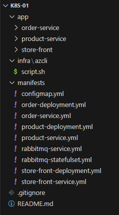

# Deploying microservice applications in AKS

    A sample multi-container application with a group of microservices and web front ends that simulate a retail scenario.

# Architesture

    # Store front: Web application for customers to view products and place orders.
    # Product service: Shows product information.
    # Order service: Places orders.
    # RabbitMQ: Message queue for an order queue.

# GitHub Repository (source code)

    https://github.com/santosh-gh/k8s-01 

# Prerequisites

    A valid Azure subscription

    VS Code: https://code.visualstudio.com/download

    GitHub Repo: https://github.com/

    Azure CLI: https://learn.microsoft.com/en-us/cli/azure/install-azure-cli?view=azure-cli-latest

    kubectl: https://kubernetes.io/docs/tasks/tools/

    bash shell: Most Linux/macOS systems already have this. For Windows, use Git Bash or WSL: https://www.atlassian.com/git/tutorials/git-bash

    Docker Desktop: Building and pushing images locally: https://docs.docker.com/desktop/

# Steps

    1. Infra deployment: az cli command line tool
    2. Build and push images to ACR: Docker Desktop command line tool
    3. App deployment: k8s manifest files and kubectl command line tool
    4. Validate and Access the application
    5. Clean the Azure resources

# Directory Structure
   

# Infra deployment

    # Login to Azure

        az login
        az account set --subscription=<subscriptionId>
        az account show

    # Show existing resources

        az resource list

    # Create RG, ACR and AKS

        ./infra/azcli/script.sh

    # Connect to cluster

        RESOURCE_GROUP="rg-onlinestore-dev-uksouth-001"
        AKS_NAME="aks-onlinestore-dev-uksouth-001"
        az aks get-credentials --resource-group $(RESOURCE_GROUP) --name $(AKS_NAME)

    # Short name for kubectl

        alias k=kubectl

    # Show all existing objects

        k get all

# Build and push images to ACR

    # Log in to ACR

        ACR_NAME="acronlinestoredevuksouth001"
        az acr login --name $ACR_NAME

    # Build and push the Docker images to ACR

        # Order Service
        docker build -t order ./app/order-service 
        docker tag order:v1 $ACR_NAME.azurecr.io/order:v1
        docker push $ACR_NAME.azurecr.io/order:v1

        # Product Service
        docker build -t product ./app/product-service 
        docker tag product:v1 $ACR_NAME.azurecr.io/product:v1
        docker push $ACR_NAME.azurecr.io/product:v1

        # Store Front Service
        docker build -t store-front ./app/store-front-service 
        docker tag store-front:v1 $ACR_NAME.azurecr.io/store-front:v1
        docker push $ACR_NAME.azurecr.io/store-front:v1

# App deployment

    # Kubernetes YAML Manifests for the applicatons

        configmap.yml
        order-deployment.yml
        order-service.yml
        product-deployment.yml
        product-service.yml
        store-front-deployment.yml
        store-front-service.yml
        rabbitmq-deployment.yml
        rabbitmq-service.yml

    # Deploy the services to AKS using kubectl and manifest files

        k apply -f ./manifests

# Verify the Deployment

    k get pods
    k get services
    Browse the app using http://<LoadBalancer public IP>:80

# Clean the Azure resources

    az group delete --name rg-onlinestore-dev-uksouth-001 --yes --no-wait